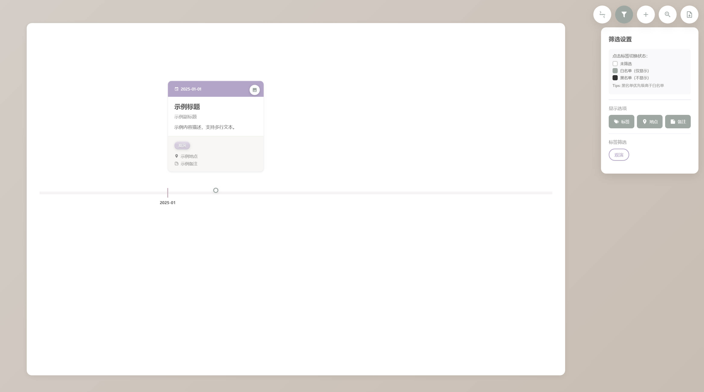

# Monochrome

这是一个时间轴。

起因只是我想有个能展示我过去事件经历的东西，

至于名字，来自Geebar《褪色的佛》的歌词 —— “直到故事都变成灰照片”。

*Powered By Claude Sonnet 4.5*

## 使用

### 数据

文本和配置在`app/data/data.yaml`下，图像存于`app/image/`下

### 启动

在app目录下运行：
~~~py
python -m http.server 8000
~~~

## 展示

